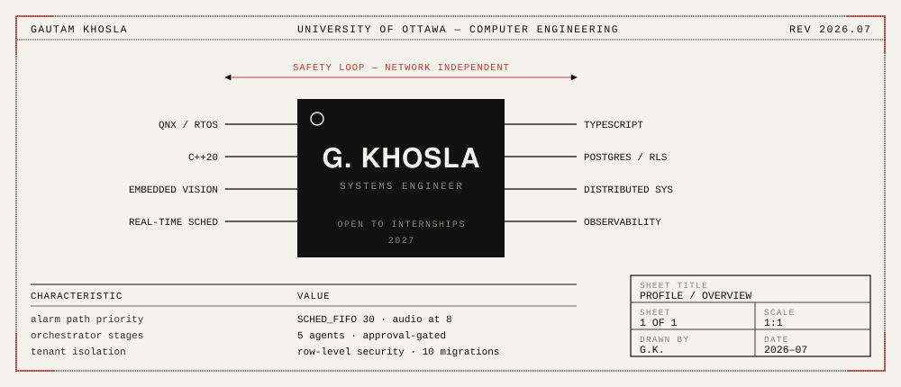
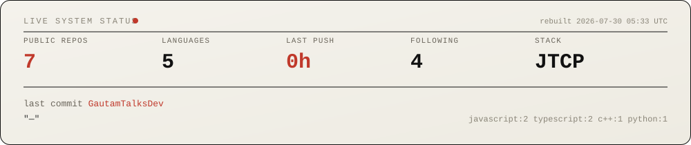

 

I build systems where the hard part is what happens when something fails — real-time scheduling guarantees, tenant isolation, human approval gates. Computer Engineering at the University of Ottawa, open to **backend / systems / infrastructure internships**.

 

Not a badge service. A scheduled Action queries the GitHub API each morning, renders this SVG, and commits it back to the repo — [`scripts/gen-status.mjs`](./scripts/gen-status.mjs)

---

## 01 · AEGIS

`C++20` · `QNX 8.0 RTOS` · `Raspberry Pi 5` · `TFLite` · [repo →](https://github.com/GautamTalksDev/AEGIS)

Deterministic edge-AI worksite safety system. Person and PPE detection run entirely on-device — the safety loop never touches the network. GPIO and relay fire at `SCHED_FIFO` priority 30; audio playback sits at priority 8, so I/O can never delay an alarm. Four QNX processes communicate over `MsgSend`/`MsgReceive` with trivially-copyable POD structs.

## 02 · HyperShift

`Next.js 14` · `Node` · `Turborepo` · `Postgres` · [repo →](https://github.com/GautamTalksDev/HyperShift) · [**live demo →**](https://hyper-shift-dashboard.vercel.app)

Describe infrastructure in plain English; five specialized agents plan, build, scan, deploy, and monitor it. Approval gates before anything ships, workspace isolation, immutable audit log, REST API and CLI.

## 03 · MetaShift

`Express` · `React` · `Supabase` · `PLpgSQL` · [repo →](https://github.com/GautamTalksDev/MetaShift)

Multi-tenant observability plane — conflict detection, auto-resolution, incident replay. Ten SQL migrations with tenant-scoped row-level security, usage metering, audit log, revocable API keys.

## 04 · Work-Shift

`Fastify` · `Cloudflare Workers` · `pnpm monorepo` · `Playwright` · [repo →](https://github.com/GautamTalksDev/Work-Shift)

AI approval inbox for Slack — nothing sends until a human approves it. Ships with `docs/AUTOMATION_REALITY.md`, which states plainly which parts are automated, which are human-in-the-loop, and which are demo-only.

## 05 · DSA

`Java` · [repo →](https://github.com/GautamTalksDev/DSA-Programming-Assignments)

Data structures and algorithms implemented through university coursework.

---

## Stack

**Systems** `C++20` `QNX` `Linux` `CMake` `TFLite` `OpenCV`
**Backend** `Node` `TypeScript` `Fastify` `Express` `Python` `Java`
**Data** `PostgreSQL` `Supabase` `MongoDB` `row-level security`
**Platform** `Docker` `Vercel` `Render` `Cloudflare Workers` `GitHub Actions`

---

