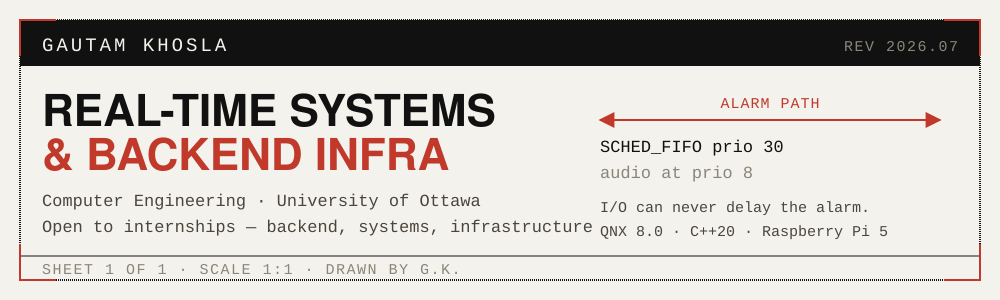
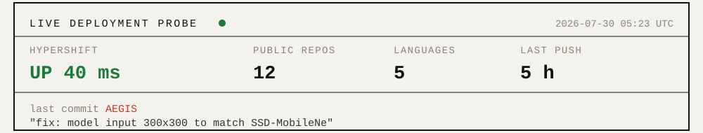

### [→ Open the live demo](https://hyper-shift-dashboard.vercel.app)

No install. The panel below reports whether it is up, probed every six hours.

 

This panel is not a badge service. A scheduled Action pings my deployments, measures latency, renders this SVG, commits it back — and opens an issue against this repo if anything is down. Source: [`scripts/gen-panel.mjs`](./scripts/gen-panel.mjs)

---

Computer Engineering at the University of Ottawa. Most of what I build is defined by its failure case, not its happy path: an alarm that fires whether or not the network is up, a deploy that refuses to ship without a human signature, a database that must never leak one tenant's rows into another's.

**Open to backend / systems / infrastructure internships.** · [developwith.gt@gmail.com](mailto:developwith.gt@gmail.com) · [LinkedIn](https://www.linkedin.com/in/gautam-khosla/) · [YouTube](http://www.youtube.com/@GautamKhoslaOfficial)

---

### [AEGIS](https://github.com/GautamTalksDev/AEGIS) — worksite safety, on-device

Detects missing PPE and fires an alarm without touching the network, because a safety alarm that needs an API call to speak isn't a safety alarm.

<b>how it holds its timing</b>
 

GPIO and relay run at `SCHED_FIFO` priority 30; voice playback sits at priority 8, so audio I/O can never delay the alarm. Four QNX processes pass trivially-copyable POD structs over `MsgSend`/`MsgReceive`. The cloud gateway makes the device smarter — never dependent.

`C++20` · `QNX 8.0 RTOS` · `Raspberry Pi 5` · `TFLite`

### [HyperShift](https://github.com/GautamTalksDev/HyperShift) — infrastructure from plain English

Describe what you want deployed; five specialized agents plan, build, scan, ship, and monitor it. **[Live →](https://hyper-shift-dashboard.vercel.app)**

<b>what keeps it from doing something stupid</b>
 

Nothing reaches production without passing an approval gate. Every run is workspace-scoped, metered, and written to an immutable audit log. REST API and CLI alongside the dashboard.

`Next.js 14` · `Node` · `Turborepo` · `Postgres`

### [MetaShift](https://github.com/GautamTalksDev/MetaShift) — multi-tenant observability

Detects conflicts across distributed services, resolves what it can, and replays any incident from the event stream.

<b>how tenants stay separated</b>
 

Ten SQL migrations building up tenant-scoped row-level security, usage metering, an append-only audit log, and revocable API keys.

`Express` · `React` · `Supabase` · `PLpgSQL`

### [Work-Shift](https://github.com/GautamTalksDev/Work-Shift) — approval inbox for AI drafts

Drafts queue up in Slack; nothing sends until a human clicks approve.

<b>the file I'm most pleased with</b>
 

`docs/AUTOMATION_REALITY.md` labels every feature as fully automated, human-in-the-loop, or demo-only. The useful thing to document is what *doesn't* work yet.

`Fastify` · `Cloudflare Workers` · `pnpm monorepo` · `Playwright`

### [DSA](https://github.com/GautamTalksDev/DSA-Programming-Assignments) — fundamentals

Data structures and algorithms implemented from scratch through coursework. `Java`

---

**Systems** `C++20` `QNX` `Linux` `CMake` `TFLite` `OpenCV`
**Backend** `Node` `TypeScript` `Fastify` `Express` `Python` `Java`
**Data** `PostgreSQL` `Supabase` `MongoDB` `row-level security`
**Platform** `Docker` `Vercel` `Render` `Cloudflare Workers` `GitHub Actions`

 

