---

Computer Engineering at the **University of Ottawa**. I build systems where the hard part is what happens when something fails — real-time scheduling guarantees, multi-tenant isolation, human approval gates.

Open to **backend / systems / infrastructure internships**.

---

### Selected work

**[AEGIS](https://github.com/GautamTalksDev/AEGIS)** · `C++20` `QNX 8.0` `Raspberry Pi 5`
Deterministic edge-AI worksite safety system. Person and PPE detection run entirely on-device — the safety loop never touches the network. GPIO and relay fire at `SCHED_FIFO` priority 30; audio playback sits at priority 8, so I/O can never delay an alarm. Node/TS cloud gateway and Next.js dashboard on top.

**[HyperShift](https://github.com/GautamTalksDev/HyperShift)** · `Next.js 14` `Node` `Turborepo` · **[live demo →](https://hyper-shift-dashboard.vercel.app)**
Describe infrastructure in plain English; five specialized agents plan, build, scan, deploy, and monitor it. Approval gates, workspace isolation, immutable audit log, REST API + CLI.

**[MetaShift](https://github.com/GautamTalksDev/MetaShift)** · `Express` `React` `Supabase/Postgres`
Multi-tenant observability plane — conflict detection, auto-resolution, incident replay. Ten SQL migrations with tenant-scoped row-level security, usage metering, audit log, revocable API keys.

**[Work-Shift](https://github.com/GautamTalksDev/Work-Shift)** · `Fastify` `Cloudflare Workers` `pnpm monorepo`
AI approval inbox for Slack: nothing sends until a human approves it. Playwright E2E, Vitest, and a `docs/AUTOMATION_REALITY.md` that states plainly which parts are automated, which are human-in-the-loop, and which are demo-only.

**[DSA-Programming-Assignments](https://github.com/GautamTalksDev/DSA-Programming-Assignments)** · `Java`
Data structures and algorithms implemented through university coursework.

---

### Stack

---

<picture>
  <source media="(prefers-color-scheme: dark)" srcset="https://raw.githubusercontent.com/GautamTalksDev/GautamTalksDev/output/snake-dark.svg" />
  
</picture>

